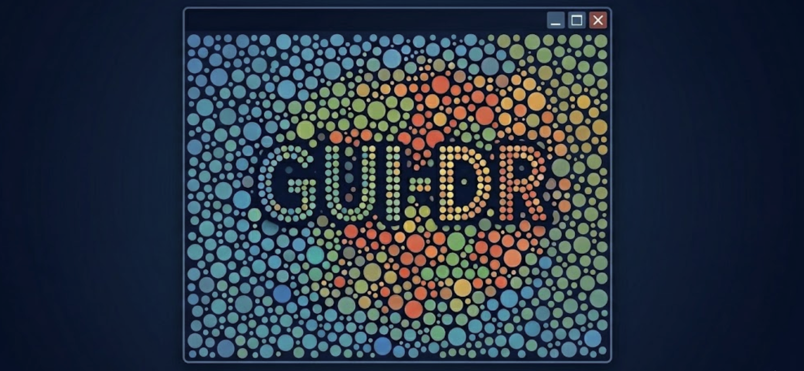
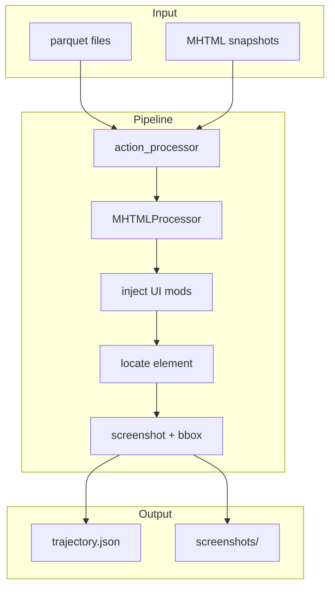

<!-- <p align="center">
  
</p> -->

<p align="center">
  
</p>


# 🩺 GUI-DR: GUI Domain-Randomization for generating diagnostic GUI grounding evaluation data
<details align="center">
<summary>
  
  <a href="https://huggingface.co/datasets/figai/GUI-Perturbed"></a>
  <a href="https://github.com/ManifoldRG/GUI-DR"></a>
  <a href="https://discord.gg/J9Auc4f4AT"></a>
</summary>
<p>
  <a href="https://blog.fig.inc/gui-perturbed-a-domain-randomization-dataset-for-gui-grounding"></a>
  <a href="https://blog.fig.inc/measuring-brittleness-in-gui-grounding-models-using-gui-perturbed"></a>
  <!-- <a href="https://blog.fig.inc/training-on-gui-perturbed-why-more-data-isnt-enough"></a> -->
</p>
</details>

### _GUI-DR is a part of a collaborative effort on Software Control Agents between Manifold Research and Fig_

<p align="center">
  <a href="https://fig.inc/" target="_blank">
    <kbd>
    <picture>
      <source media="(prefers-color-scheme: dark)" srcset="media/fig_logo_with_text_dark.svg">
      <source media="(prefers-color-scheme: light)" srcset="media/fig_logo_with_text_light.svg">
      
    </picture>
    </kbd>
  </a>
  <a href="https://www.manifoldrg.com/" target="_blank">
    <kbd>
    
    </kbd>
  </a>
</p>

<!-- ### _Need to Run Evaluations on Production Computer Use System?_ -->

## Overview

**GUI-DR** is a data augmentation pipeline built on domain randomization principles.

GUI grounding models often rely on visual primitives (shape, position, color) rather than functional semantics, and fixed-scene benchmarks do not reveal how they degrade under distribution shift. Using [Mind2Web](https://mind2web.github.io/) MHTML archives, GUI-DR varies _visual scenes_ and _instructions_ along controlled axes to generate data to evaluate or finetune models for use cases such as GUI grounding.


---

## 📢 Updates

- **2026-04** Initial release of [GUI-Perturbed](https://huggingface.co/datasets/figai/GUI-Perturbed), [technical report](https://blog.fig.inc/gui-perturbed-a-domain-randomization-dataset-for-gui-grounding/), and data generation pipeline [GUI-DR](https://github.com/ManifoldRG/GUI-DR).

---

## 💾 Installation

**Requirements:** Python ≥ 3.11. Download [Mind2Web](https://mind2web.github.io/) data under `mm_mind2web/`.

```bash
git clone https://github.com/ManifoldRG/GUI-DR.git
cd GUI-DR
```

Install with **uv** or **pip** below. Versions are pinned in [uv.lock](uv.lock) (see [pyproject.toml](pyproject.toml)). Playwright browsers are required to run the pipeline.

### uv

[Install uv](https://docs.astral.sh/uv/getting-started/installation/), then:

```bash
uv sync
uv run playwright install
```

Use `uv run python …` from the repo root (or `source .venv/bin/activate` and run `python` as usual). Example: `uv run python src/main.py --split test_task`.

### pip + venv

```bash
python3.11 -m venv .venv
source .venv/bin/activate   # Windows: .venv\Scripts\activate
pip install -e .
playwright install
python src/main.py --split test_task
```

### After installing (all options)

1. **`mm_mind2web/`** (gitignored) at the repo root:

   - `mm_mind2web/data/<split>-*.parquet`
   - `mm_mind2web/task/<task_uid>/processed/dom_content.json`
   - `mm_mind2web/task/<task_uid>/processed/snapshots/*.mhtml`

   **Parquets:** [Multimodal-Mind2Web on Hugging Face](https://huggingface.co/datasets/osunlp/Multimodal-Mind2Web) → `mm_mind2web/data/` (e.g. `train-*.parquet`, `test_task-*.parquet`).

   **Raw dump:** Task trees with `processed/dom_content.json` and `processed/snapshots/*.mhtml` per [Mind2Web raw dump](https://github.com/OSU-NLP-Group/Mind2Web?tab=readme-ov-file#raw-dump-with-full-traces-and-snapshots). Symlink or copy so each task is `mm_mind2web/task/<task_uid>/…`. Optional: [scripts/globus_mind2web_downloader.sh](scripts/globus_mind2web_downloader.sh) for Globus transfer (needs endpoint + `.env`).

   Parquet rows and `task_uid` paths must refer to the same tasks.

2. **(Optional)** For debug logging or scripts that use Globus/API keys, copy [.env.example](.env.example) to `.env` and set any variables you need.

---

## 🚀 Quick Start

Default: `test_task` split, **Style** variant.

**uv** (from repo root):

```bash
uv run python src/main.py --split test_task
```

**pip** ([venv activated](#pip--venv)):

```bash
python src/main.py --split test_task
```

Outputs: `outputs/run_<timestamp>_test_task/<task_uid>/` with `screenshots/` and `trajectory.json`. Other variants: [Generating data](#-generating-data).

---

## 🧪 Generating data

One run produces one variant. Choose flags to match the variant you want. Run from the **repo root** with the venv active (pip) or prefix with `uv run` (uv).

### By variant

```bash
# Original (no perturbations)
python src/main.py --split test_task --enable_zoom false --enable_dense_info false --enable_style_variants false

# Precision (viewport zoom 0.7×)
python src/main.py --split test_task --enable_zoom true --zoom_level 0.7 --enable_dense_info false --enable_style_variants false

# Style (colors, fonts, restyling) — default
python src/main.py --split test_task --enable_style_variants true --enable_zoom false --enable_dense_info false

# Text Shrink (reduced font size)
python src/main.py --split test_task --enable_dense_info true --enable_style_variants false --enable_zoom false
```

### Arguments

| Argument | Default | Description |
|----------|---------|-------------|
| `--split`, `-s` | `train` | Split: `train`, `test_domain`, `test_task`, `test_website`. |
| `--enable_zoom` | `False` | Enable viewport zoom (Precision). |
| `--zoom_level` | `0.7` | Zoom level: `0.7`, `0.5`, or `0.3`. |
| `--enable_dense_info` | `False` | Enable text shrink. |
| `--enable_style_variants` | `True` | Enable style randomization. |

### Output

`outputs/run_<timestamp>_<split>/<task_uid>/` contains `screenshots/` and `trajectory.json`. Use one run per variant when building evaluation data or downstream tooling.

### Pipeline overview

**Input:** Parquet files for the split, plus per-task `dom_content.json` and MHTML snapshots in `mm_mind2web/`.

**Flow:** Load parquet → for each task, load MHTML snapshots in order → per step: optionally inject UI modifications (style / zoom / text shrink) → resolve target element from parquet → capture screenshot and bbox → write `trajectory.json` and screenshots.



**Perturbations**

| Variant | Config | Implementation |
|---------|--------|-----------------|
| **Original** | All off | No injection. |
| **Style** | `enable_style_variants=True` | [randomization](src/ui/randomization.py), [generator](src/ui/generator.py), [templates](src/ui/templates.py). |
| **Precision** | `enable_zoom=True`, `zoom_level` ∈ {0.7, 0.5, 0.3} | [zoom](src/ui/zoom.py). |
| **Text Shrink** | `enable_dense_info=True` | [dense_info](src/ui/dense_info.py). |

Instructions are generated per step from parquet `target_action_reprs` via [generate_step_instruction](src/utils/helpers.py). Config: [config](src/ui/config.py); injection: [injection](src/ui/injection.py).

---

## Data & resources

| Resource | Description |
|----------|-------------|
| **[GUI-Perturbed](https://huggingface.co/datasets/figai/GUI-Perturbed)** | Released evaluation data (screenshots, instructions, ground-truth bboxes). |
| **[Baseline result viewer](https://huggingface.co/spaces/figai/GUI-Perturbed-Baseline-Result-Viewer)** | Streamlit Space: baseline 7B GUI grounding predictions on original vs perturbed screenshots. |
| **[Finetuned result viewer](https://huggingface.co/spaces/figai/GUI-Perturbed-Finetuned-Result-Viewer)** | Streamlit Space: finetuned-checkpoint predictions, same layout as the baseline viewer. |

**Dataset summary**

| Aspect | Description |
|--------|-------------|
| **Source** | Mind2Web MHTML archives (real web pages, DOM preserved). |
| **Visual variants** | **Original**, **Style**, **Precision** (zoom 0.7), **Text Shrink**. ~390 screens per variant. |
| **Schema** | `visual_variant`, `instruction_type`, `task_id`, `step_index`, `instruction`, `gt_bbox`, `screenshot`. See the [dataset card](https://huggingface.co/datasets/figai/GUI-Perturbed). |
| **Instructions** | **Direct** (constructed from `target_action_reprs`); **relational** (in released schema). |

Use **this repo** to reproduce or extend the data; use the **Hugging Face dataset** for evaluation.

---

## Evaluation

The evaluation script loads data directly from [GUI-Perturbed](https://huggingface.co/datasets/figai/GUI-Perturbed) on HuggingFace and runs inference against a model served via an OpenAI-compatible API (e.g., [vLLM](https://docs.vllm.ai/)).

### Prerequisites

**Serve your model** with vLLM (or any OpenAI-compatible endpoint):

```bash
# Example: serve UI-TARS-1.5-7B with vLLM
vllm serve ByteDance-Seed/UI-TARS-1.5-7B --port 8000
```

### Running evaluation

```bash
uv run scripts/gui_perturbed_evaluator.py \
    --output_dir data/predictions \
    --config_id uitars15_no_reasoning_direct_query \
    --dataset_variant original
```

### Arguments

| Argument | Default | Description |
|----------|---------|-------------|
| `--output_dir` | _(required)_ | Directory for prediction output files. |
| `--config_id` | _(required)_ | Preset configuration ID. Use `--list_presets` to see all options. |
| `--dataset_variant` | `None` (all) | Filter by variant: `original`, `style`, `precision`, `text_zoom`. |
| `--model_name` | _(from preset)_ | Override the HuggingFace model identifier sent to the API. |
| `--api_url` | `http://localhost:8000/v1` | API endpoint (or set `VLLM_API_URL` env var). |
| `--api_key` | `EMPTY` | API key (or set `VLLM_API_KEY` env var). |
| `--temperature` | `0.0` | Sampling temperature. |
| `--max_tokens` | _(model-specific)_ | Max tokens for generation. |
| `--seed` | `None` | Random seed for reproducibility. |
| `--save_interval` | `10` | Save predictions to disk every N steps. |

### Available presets

Presets are generated for all combinations of **model** × **reasoning** × **instruction type**:

- **Models:** `gta1` (GTA1-7B), `qwen25vl` (Qwen2.5-VL-7B), `uitars15` (UI-TARS-1.5-7B)
- **Reasoning:** `no_reasoning`, `reasoning`
- **Instruction type:** `direct_query`, `relational_query`

Example preset IDs: `gta1_no_reasoning_direct_query`, `qwen25vl_reasoning_relational_query`, `uitars15_no_reasoning_direct_query`.

List all presets:

```bash
uv run scripts/gui_perturbed_evaluator.py --list_presets
```

---

## Limitations

- **Perturbation realism** - We prioritize diagnostic coverage over photorealism; some variants may look synthetic but still reveal reliance on color, position, or layout.
- **Instruction diversity** - The pipeline produces direct referring expressions; relational phrasings appear in the released dataset; broader natural-language diversity is future work.
- **Web only** - Desktop, mobile, and cross-application flows are out of scope.

---

## ❓ FAQ

### Where do I get the Mind2Web data?

See the [Mind2Web project](https://mind2web.github.io/) for data access. Place it under `mm_mind2web/` with the structure described in [Installation](#-installation).

---

## Contributing

We welcome contributions: new perturbation types, bug reports, and improvements. Open an issue or pull request or reach out at our [discord server](https://discord.gg/J9Auc4f4AT).

---

## 📄 Citation

If you find GUI-Perturbed or this pipeline useful, please cite the dataset and technical report series.

```bibtex
@dataset{gui_perturbed_2026,
  title   = {GUI-Perturbed: A Domain-Randomized Dataset for GUI Grounding},
  author  = {Wang, Yangyue and Sikka, Harsh and Mathur, Yash, and Zhou, Tony and Nyachhyon, Jinu and Guruprasad, Pranav},
  year    = {2026},
  url     = {https://huggingface.co/datasets/figai/GUI-Perturbed},
  note    = {Built on Mind2Web (Deng et al., 2023)}
}

@software{gui_dr_code_2026,
  title   = {GUI-DR: GUI Domain-Randomization for generating diagnostic GUI grounding evaluation data},
  author  = {Wang, Yangyue and Sikka, Harsh and Mathur, Yash, and Zhou, Tony and Nyachhyon, Jinu and Guruprasad, Pranav},
  year    = {2026},
  url     = {https://github.com/ManifoldRG/GUI-DR},
  note    = {Data augmentation pipeline for GUI-Perturbed}
}

@online{gui_perturbed_technical_report_2026,
  title   = {GUI-Perturbed: A Domain Randomization Dataset for GUI Grounding},
  author  = {Wang, Yangyue and Sikka, Harsh and Mathur, Yash, and Zhou, Tony and Nyachhyon, Jinu and Guruprasad, Pranav},
  year    = {2026},
  url     = {https://blog.fig.inc/gui-perturbed-a-domain-randomization-dataset-for-gui-grounding},
  note    = {Part 1: Dataset \& methodology}
}

@online{measuring_gui_models_robustness_technical_report_2026,
  title   = {Measuring Brittleness in GUI Grounding Models using GUI-Perturbed},
  author  = {Wang, Yangyue and Mathur, Yash, and Zhou, Tony and Nyachhyon, Jinu and Guruprasad, Pranav and Sikka, Harsh},
  year    = {2026},
  url     = {https://blog.fig.inc/measuring-brittleness-in-gui-grounding-models-using-gui-perturbed},
  note    = {Part 2: Baseline evaluation}
}

@online{training_on_gui_perturbed_technical_report_2026,
  title   = {Training on GUI-Perturbed: Why More Data Isn’t Enough},
  author  = {Wang, Yangyue and Mathur, Yash, and Zhou, Tony and Nyachhyon, Jinu and Guruprasad, Pranav and Sikka, Harsh},
  year    = {2026},
  url     = {https://blog.fig.inc/training-on-gui-perturbed-why-more-data-isnt-enough},
  note    = {Part 3: Finetuning Experiments}
}
```
